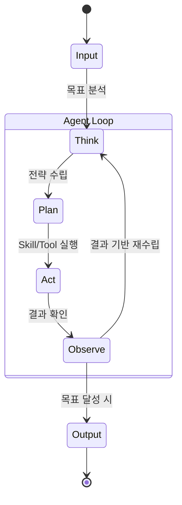

> [!ABSTRACT] 핵심 요약
>
스스로 계획하고(Plan), 행동하고(Act), 결과를 관찰하여(Observe) 목표를 달성하는 주체.

### **1) 정의 (Definition)**

- **Autonomous Agent (자율 에이전트)**는 사람의 개입 없이 주어진 목표를 달성하기 위해 **연속적인 의사결정 과정(Loop)**을 수행하는 AI 시스템입니다.
    
- 단순히 질문에 답하는 챗봇(Chatbot)과 달리, 에이전트는 **행동(Action)**을 통해 상태를 변화시킵니다.

### **2) 핵심 루프 (The Agentic Loop)**

에이전트는 보통 **ReAct (Reason + Act)** 패턴을 따릅니다.

1. **Perceive (인지):** 사용자 명령이나 환경 변화를 인식.
    
2. **Think/Plan (생각):** 목표 달성을 위해 필요한 단계(Chain of Thought)를 계획.
    
3. **Act (행동):** 적절한 **Skill**을 선택하여 실행 (MCP 등을 통해).
    
4. **Observe (관찰):** 행동의 결과를 확인. (에러가 나면 수정 계획 수립).
    
5. **Repeat:** 목표가 완료될 때까지 반복.

#### **3) 구조 다이어그램 (Mermaid)**

