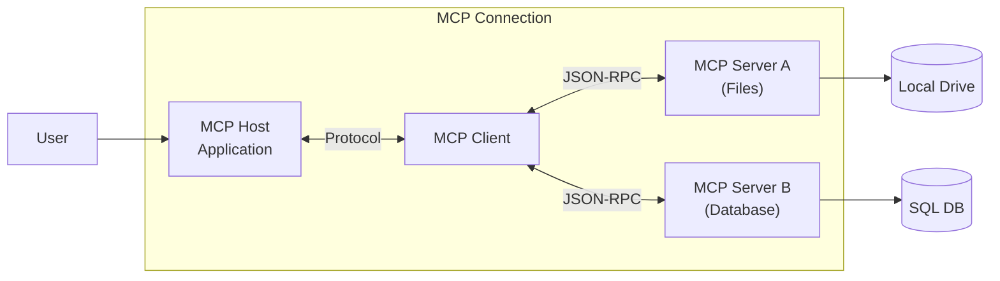

> [!ABSTRACT] 핵심 요약
>
AI 모델과 외부 시스템(데이터/도구)을 연결하는 표준 인터페이스 프로토콜.

### **1) 정의 (Definition)**

- **MCP (Model Context Protocol)**는 Anthropic이 제안한 오픈 소스 표준으로, LLM(대형 언어 모델)이 로컬 파일, 데이터베이스, 웹 서비스 등 외부 데이터 소스에 안전하고 일관된 방식으로 접근할 수 있게 해주는 통신 규약입니다.
    
- **개발자 관점 비유:** 다양한 주변기기를 하나의 포트로 연결하는 **USB**와 같으며, 소프트웨어적으로는 서로 다른 서비스를 연결하는 **API Gateway**나 **Interface** 역할을 합니다.

### **2) 구조 (Architecture)**

MCP는 크게 3가지 요소로 구성됩니다.

1. **MCP Host (호스트):** LLM을 실행하는 애플리케이션 (예: Claude Desktop, IDE, Terminal 등). 연결을 주관하는 '본체'입니다.
    
2. **MCP Client (클라이언트):** 호스트 내에서 실제로 서버와 통신하는 모듈. LLM과 서버 사이의 통역사 역할을 합니다.
    
3. **MCP Server (서버):** 실제 데이터나 도구를 제공하는 제공자 (예: Google Drive 서버, 로컬 파일 시스템 서버, PostgreSQL 서버).

### **3) 작동 방식 (Mermaid Diagram)**

