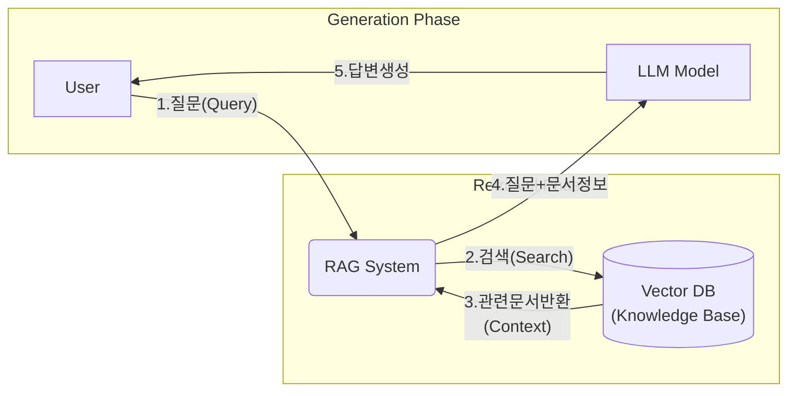

> [!ABSTRACT] 핵심 요약
>
LLM에게 "오픈북 테스트"를 보게 하는 기술. (검색 후 생성)

### **1) 정의 (Definition)**

- **RAG (Retrieval-Augmented Generation, 검색 증강 생성)**는 LLM이 학습하지 않은 최신 정보나 기업 내부의 비공개 데이터(Private Data)를 답변에 활용할 수 있도록, **외부에서 정보를 찾아(Retrieval) 답변 생성(Generation)에 참고**시키는 아키텍처입니다.

### **2) 작동 원리 (Workflow)**

1. **질문(User Query):** 사용자가 질문을 던짐.
    
2. **검색(Retrieve):** 질문과 관련된 문서를 데이터베이스(Vector DB)에서 찾아옴.
    
3. **증강(Augment):** 찾은 문서를 프롬프트에 "참고 자료"로 끼워 넣음.
    
4. **생성(Generate):** LLM이 참고 자료를 보고 답변을 작성.

#### **3) 구조 다이어그램 (Mermaid)**

---

> [[AI 학습 인덱스]]